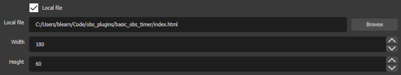
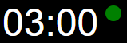

# Basic OBS Timer

Countdown timer with alarm sound. Designed to be used in OBS scenes as a browser source.

## Install

Download the [latest release](https://github.com/learnb/basic_obs_timer/releases/download/v1.0/basic_obs_timer_v1-0.zip) and extract the .zip file in your preferred location. Keep note of the directory you extract the files to so you can find them during configuration.

## Configuration

#### OBS Browser Source

To place the timer in a scene you will need to add a new 'Local file' browser source. The 'Local file' needs to point to the "index.html" file that you extracted during the Install step.



For example, I extracted the zip to "C:/Users/blearn/Code/obs_plugins/basic_timer/" so the full path for my file is: "C:/Users/blearn/Code/obs_plugins/basic_timer/index.html"

Setting the Width to 180 and Height to 60 should work in most cases but you can adjust the sizes to fit your needs.

#### Timer Settings

The duration of the timer and the audio file that plays can be configured. You can also set the volume level (0-10; 0 for muted, 10 for max volume). Optional configuration options are described below. These settings are in the file called "config.js".  The default settings are:

```
conf = {
    "audio_filename": "alarm.mp3",
    "minutes": 3,
    "seconds": 0,
    "volume": 10,
}
```

Use any text editor to open "config.js" and modify the settings as needed.

__Configuration Option Descriptions__

|Option Name|Description|Datatype|
--|--|--
|audio_filename|File path to the audio file to be played|string|
|minutes|The number of minutes the timer should run.|integer|
|seconds|The additonal number of seconds the timer should run (added to the minutes). |integer|
|volume|Control output volume with a number from 0 to 10. 10 is max volume, 0 is muted.|integer|
|hideLight|(optional) If true, hides the light/button during the countdown.|boolean|

## Usage

#### OBS Interact with Browser Source

To start/stop the timer you must interact with the browser source you created for the timer (see Configuration). To interact with any browser source through OBS, right-click on the source in your "Sources" list and click on "Interact". This will bring up a separate window where you can click on the webpage.

#### General Usage

When the page loads the clock will be set to the configured duration (by default 3 minutes).

**Start Timer**



To start the countdown click on the green button.

**Reset Timer**


To reset the timer click on the red button.

**Pause/Resume Timer**

You can click on the clockface to pause the timer. To resume, click the clockface again. While paused the time text will be grey.

**Alarm**

When the timer reaches zero it will play the configured audio file (by default "alarm.mp3").

